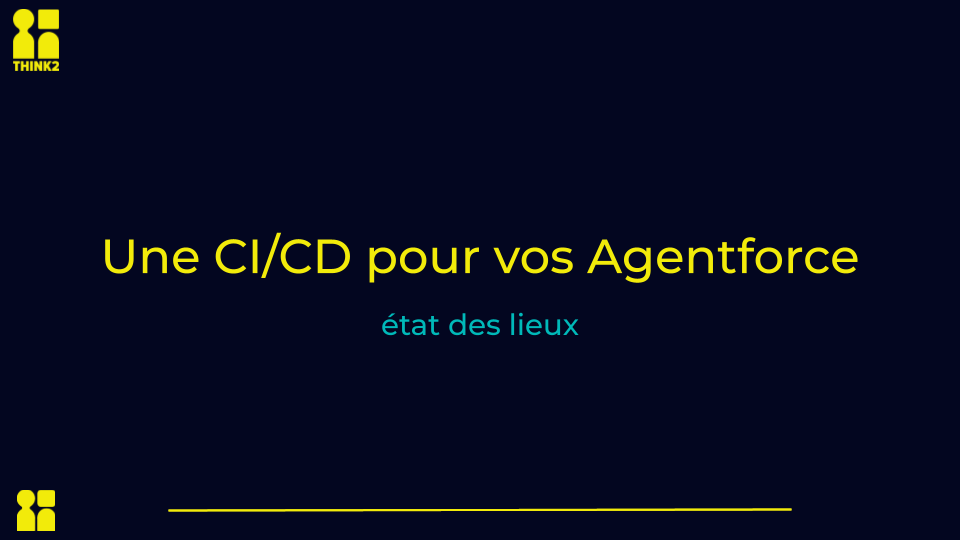

# Agentforce CICD

## 🎯 Presentation Demo Repository

This repository was created for the **Paris Salesforce Dev Group** presentation on **November 5th, 2025**.

**Presentation Title**: `Une CI/CD pour vos Agentforce : état des lieux`

**Presenter**: [@nabondance](https://github.com/nabondance)

## 💡 Presentation Slides

[](https://docs.google.com/presentation/d/1-kYRPyL2792Mu3WCTfTFenWKxlG5TSbd2vSTt9fQYrA)

The PDF: [pdf](./resources/Slides.pdf)

The video: [Coming soon]

## 📖 What's in this demo?

This repository demonstrates a complete CI/CD pipeline for Salesforce Agentforce development, showcasing:

- ✅ **Automated Agent Testing** - Parallel execution with dynamic test discovery
- ✅ **Scratch Org Pool Management** - Efficient org provisioning using @flxbl-io/sfp
- ✅ **Quality Gates** - 75% test pass threshold enforcement
- ✅ **GitHub Actions Integration** - Complete PR validation and release workflow
- ✅ **Production Deployment** - Automated release to target org on merge

## 🏗️ Demo Architecture

The demo showcases three main workflows:

### 1. Agent Validation Pipeline (`agentforce-validate.yml`)
**Triggered on**: Pull Requests to main
```
Setup → Deploy → Test Discovery → Parallel Testing → Validation → Cleanup
```

### 2. Agentforce Release (`agentforce-release.yml`)
**Triggered on**: Pull Request merged to main
```
Setup → Authenticate → Deploy to Production Org
```

### 3. Pool Preparation (`prepare-pools.yml`)
**Name**: "Prepare Pools"
**Triggered on**: Manual/Scheduled
```
Authenticate → Prepare Pools (CI&Dev) → Configure Orgs
```

To know more about pool strategies, see the talk `How Scratch Orgs Pools Fit Into Your Salesforce Strategy`
- [📄 Slides](https://speakerdeck.com/nabondance/frenchtouchdreamin-elevate-your-devops-how-scratch-orgs-pools-fit-into-your-salesforce-strategy)
- [🎬 Video](https://www.youtube.com/watch?v=09WEqN1emIM)

## 🚀 How to use this demo

### Quick Start (Demo Environment)
1. **Fork this repository**
2. **Set up secrets** in your GitHub repo:
   - `DEVHUB_SFDX_AUTH_URL`: Your Dev Hub auth URL
   - `ORG_SFDX_AUTH_URL`: Your target org auth URL (for releases)
3. **Create a PR** to see the validation pipeline in action
4. **Merge the PR** to trigger the release workflow
5. **Watch the workflows** execute automatically

## 📋 Demo Components Explained

### Agentforce Metadata (`manifestAgent.xml`)
Includes all Agentforce-related metadata types:
- GenAiPromptTemplate
- GenAiFunction
- GenAiPlugin
- Bot & BotBlock
- BotTemplate
- AiEvaluationDefinition

### Pool Configuration (`config/pools/*.json`)
Optimized for CI/CD with:
- Quick org provisioning (10-day expiry)
- Agentforce features enabled
- Post-deployment automation

### Scratch Org Definition (`config/project-scratch-def.json`)
Pre-configured with:
- Agentforce features enabled
- Developer edition optimized

## 📊 Key Takeaways from the Presentation

1. **Parallel Testing**: Dynamic matrix generation for optimal performance
2. **Pool Management**: Significant time savings vs on-demand org creation
3. **Quality Gates**: Automated enforcement of testing standards
4. **Artifact Handling**: Secure org authentication across jobs
5. **Error Handling**: Robust failure scenarios and cleanup

## 🔧 Technologies Demonstrated

- **GitHub Actions**: CI/CD orchestration
- **Salesforce CLI**: Metadata operations and testing
- **@flxbl-io/sfp**: Advanced DevOps capabilities
- **pnpm**: Fast package management
- **Docker**: Containerized execution environment

## 📚 Resources

- [Salesforce CLI Guide](https://developer.salesforce.com/tools/sfdxcli)
- [Agentforce Guide](https://www.salesforce.com/agentforce/guide/)
- [@flxbl-io/sfp Documentation](https://docs.flxbl.io/)

## 🤝 Questions & Discussion

Feel free to open issues or start discussions about any aspect of this CI/CD approach!
You can contact me directly on LinkedIn: [Nathan Abondance](https://www.linkedin.com/in/nabondance/)

---

**Note**: This is a demonstration repository. Adapt the configurations to your organization's specific requirements before using in production.

**Maintenance**: I will try to keep this repo up-to-date with the latest Salesforce and Agentforce features, don't forget to star/follow it.

🫶