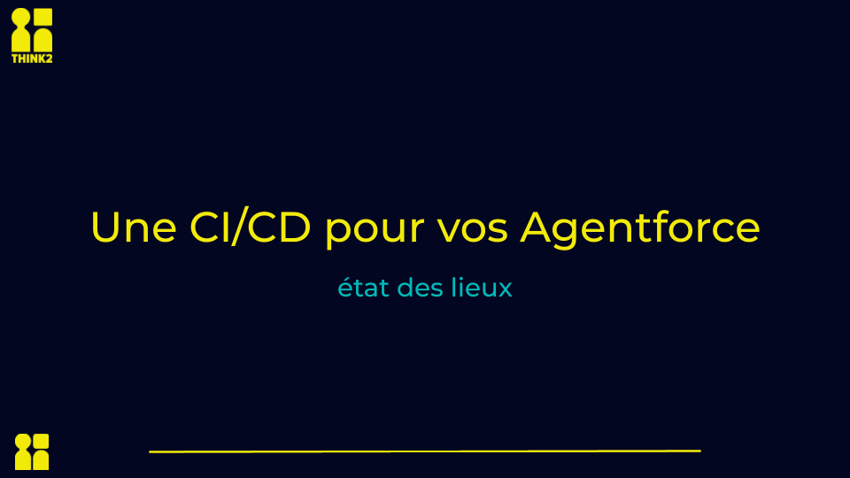
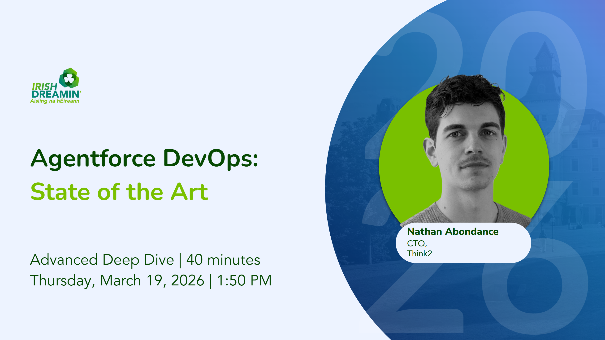

# Agentforce CI/CD

This repository contains two conference demos showcasing Agentforce CI/CD pipelines, one per Agentforce kind, one per event.

**Presenter**: [@nabondance](https://github.com/nabondance)

---

## Demo 1 — Agentforce Classic

**Event**: Paris Salesforce Dev Group: November 5th, 2025
**Talk**: `Une CI/CD pour vos Agentforce : état des lieux`

[](https://docs.google.com/presentation/d/1-kYRPyL2792Mu3WCTfTFenWKxlG5TSbd2vSTt9fQYrA)

[Slides](https://docs.google.com/presentation/d/1-kYRPyL2792Mu3WCTfTFenWKxlG5TSbd2vSTt9fQYrA) | [Slides PDF](./agentforce-classic/resources/Slides.pdf) | [Video](https://www.youtube.com/watch?v=d0er1JVcqvY)

Classic Agentforce uses the standard declarative bot metadata approach. The CI/CD pipeline handles the full lifecycle: scratch org pool provisioning, metadata deployment, parallel agent testing with a quality gate, and automated production release.

**Key characteristics of Classic:**
- 6+ metadata types to manage (Bot, BotBlock, BotTemplate, GenAiPlannerBundle, GenAiFunction, GenAiPlugin...)
- Source tracking broken on GenAiPlannerBundle — must use `--manifest`
- Must deactivate agent before deploying, reactivate after
- Test definitions (`AiEvaluationDefinition`) deployed separately

**Workflows** (`.github/workflows/`):
| Workflow | Trigger | Flow |
|----------|---------|------|
| `agentforce-validate.yml` | PR to main | Setup → Deploy → Test Discovery → Parallel Testing → Validation → Cleanup |
| `agentforce-release.yml` | PR merged to main | Authenticate → Deactivate → Deploy → Reactivate |

**Folder** (`agentforce-classic/`):
```
agentforce-classic/
├── force-app/        # Salesforce metadata (bots, prompt templates, AI bundles)
├── scripts/          # manage-agents, postDeployment, retrieve helpers
├── resources/        # Slides and assets
├── manifest.xml      # Metadata types for deployment
└── sfdx-project.json # Scoped package directory for CI
```

---

## Demo 2 — Agentforce Script

**Event**: Irish Dreamin': March 19th, 2026
**Talk**: `Agentforce DevOps: state of the art`

[](./agentforce-script/resources/Slides.pdf)

[Slides](https://speakerdeck.com/nabondance/agentforce-devops-state-of-the-art) | [Slides PDF](./agentforce-script/resources/Slides.pdf) | Video: coming after the event

Agentforce Script is the new approach introduced in Spring '25. Instead of managing multiple bot metadata types, agents are defined as a single script file (`aiAuthoringBundle`) and published via CLI. The CI/CD pipeline adapts to this new model.

**Key differences from Classic:**
- 1 metadata type to manage (`aiAuthoringBundle`) — much cleaner
- Source tracking works on `aiAuthoringBundle`
- No deactivation needed before deploy — `sf agent publish` creates a new inactive version, then activate after
- `subjectVersion` in test definitions must match the active BotVersion — patched dynamically in CI

**Workflows** (`.github/workflows/`):
| Workflow | Trigger | Flow |
|----------|---------|------|
| `agentforce-script-validate.yml` | PR to main | Setup → Deploy dependencies → Publish → Activate → Patch test versions → Deploy Tests → Parallel Testing → Validation → Cleanup |
| `agentforce-script-release.yml` | PR merged to main | Authenticate → Deploy dependencies → Publish → Activate |

**Folder** (`agentforce-script/`):
```
agentforce-script/
├── force-app/        # Salesforce metadata (aiAuthoringBundle, prompt templates)
├── scripts/          # publishAgents, activateAgents, patchTestVersions, retrieve/deploy helpers
├── resources/        # Slides and assets
├── manifest.xml      # Metadata types for deployment (dependencies only)
└── sfdx-project.json # Scoped package directory for CI
```

---

## Quick Start

1. **Fork this repository**
2. **Set up secrets** in your GitHub repo:
   - `DEVHUB_SFDX_AUTH_URL`: Your Dev Hub auth URL
   - `ORG_SFDX_AUTH_URL`: Your target org auth URL (for releases)
3. **Prepare scratch org pools** by running the `Prepare Pools` workflow manually
4. **Create a PR** to trigger the validation pipeline
5. **Merge the PR** to trigger the release workflow
6. **Watch the workflows** execute automatically

---

## Shared Infrastructure

### Pool Preparation (`.github/workflows/prepare-pools.yml`)

Provisions scratch org pools shared by both demo CI pipelines. Triggered manually or on schedule.

```
Authenticate Dev Hub → Prepare CI pool → Prepare Dev pool → Configure orgs
```

To learn more about pool strategies: `How Scratch Orgs Pools Fit Into Your Salesforce Strategy`
- [Slides](https://speakerdeck.com/nabondance/frenchtouchdreamin-elevate-your-devops-how-scratch-orgs-pools-fit-into-your-salesforce-strategy)
- [Video](https://www.youtube.com/watch?v=09WEqN1emIM)

### Required GitHub Secrets

| Secret | Used by |
|--------|---------|
| `DEVHUB_SFDX_AUTH_URL` | All workflows (pool fetch, cleanup) |
| `ORG_SFDX_AUTH_URL` | Release workflows (production deploy) |

---

## Repository Structure

```
AgentforceCICD/
├── .github/
│   └── workflows/
│       ├── agentforce-validate.yml         # Classic validate workflow
│       ├── agentforce-release.yml          # Classic release workflow
│       ├── agentforce-script-validate.yml  # Script validate workflow
│       ├── agentforce-script-release.yml   # Script release workflow
│       └── prepare-pools.yml               # Shared pool preparation
├── agentforce-classic/                 # Demo 1 — self-contained
├── agentforce-script/                  # Demo 2 — self-contained
├── config/                             # Shared pool & scratch org configs
├── sfdx-project.json                   # Local dev (both package dirs)
└── package.json
```

---

## Technologies

- **GitHub Actions** — CI/CD orchestration
- **Salesforce CLI** — Metadata operations and agent testing
- **@flxbl-io/sfp** — Scratch org pool management
- **pnpm** — Package management
- **Docker** — Containerized job execution

## Resources

- [Salesforce CLI Guide](https://developer.salesforce.com/tools/sfdxcli)
- [Agentforce Guide](https://www.salesforce.com/agentforce/guide/)
- [@flxbl-io/sfp Documentation](https://docs.flxbl.io/)

## Questions & Discussion

Open an issue or reach out on LinkedIn: [Nathan Abondance](https://www.linkedin.com/in/nabondance/)

---

**Note**: This is a demonstration repository. Adapt configurations to your organization's requirements before using in production.

**Maintenance**: Kept up-to-date with the latest Salesforce and Agentforce features — star/follow to stay updated.
